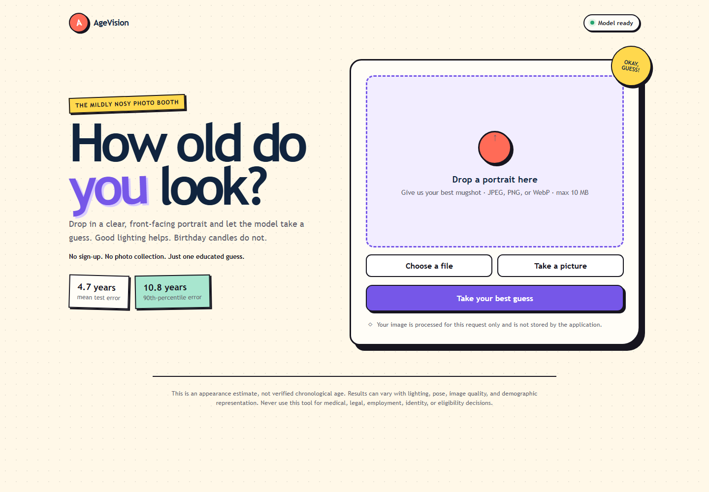

# AgeVision

An end-to-end computer-vision system for estimating **apparent age** from a face image.
AgeVision supports exact-age regression and age-group classification, reports benchmark
error, and evaluates results across age and demographic slices. It is a research/education project,
not an identity, eligibility, or medical decision system.

**Live application:** [agevision.onrender.com](https://agevision.onrender.com)



## System

```text
UTKFace images -> validate/split -> crop + normalize -> EfficientNet-B0 -> age estimate
                                                                      -> evaluation report
Uploaded image -> YuNet face detection -> FastAPI -> same transforms -> estimate -> web UI
```

## Features

- UTKFace filename parsing and reproducible train/validation/test manifests
- ResNet18 and EfficientNet-B0 transfer learning or a small CNN baseline
- Optional moderate age-group balancing during training
- YuNet face detection and cropping for uploaded portraits
- Regression and age-group classification experiments
- MAE, RMSE, error percentiles, and metrics by age, gender, and ethnicity labels
- FastAPI image-upload endpoint and browser interface
- Portrait upload or in-browser camera capture
- Unit and browser tests, Docker image, and GitHub Actions CI

## Quick start

1. Use Python 3.10+ and install `pip install -e ".[dev]"`.
   To run browser tests, also install Chromium with `python -m playwright install chromium`.
2. Download UTKFace and place its `.jpg` files under `data/raw/UTKFace/`.
3. Build manifests: `python -m src.ingestion --input data/raw/UTKFace`.
4. Train: `python -m src.train --task regression --epochs 10`.
   Add `--balanced-sampling` to moderately oversample rarer age groups.
5. Evaluate: `python -m src.evaluate --checkpoint models/agevision_regression.pt`.
   Use `--output reports/experiment-name.json` to preserve a named experiment report.
6. Serve: `uvicorn src.api:app --reload`, then open <http://localhost:8000>.

Run `pytest` for tests. Training defaults live in `configs/model.yaml`; CLI flags can
override the most common settings. The API returns HTTP 503 until a checkpoint exists.
The upload flow expects a single, front-facing portrait; UTKFace itself contains aligned faces.
Set `AGEVISION_CHECKPOINT` to serve a checkpoint other than
`models/agevision_regression.pt`.
The repository includes that optimized serving checkpoint; other generated training
checkpoints remain excluded from version control.

Uploaded portraits are processed with the MIT-licensed YuNet detector from the
[OpenCV Model Zoo](https://github.com/opencv/opencv_zoo/tree/main/models/face_detection_yunet).
Uploads with no detectable face or more than one detected face are rejected.

## Experiment results

Five-epoch regression experiments on the current UTKFace split produced:

| Model | Test MAE | Test RMSE | 60+ MAE |
| --- | ---: | ---: | ---: |
| ResNet18 | 5.251 | 7.452 | 8.245 |
| EfficientNet-B0 | **5.204** | **7.133** | **7.176** |
| ResNet18 with balanced sampling | 5.296 | 7.470 | 9.289 |
| EfficientNet-B0, 10-epoch run through YuNet | **4.956** | **7.124** | 8.076 |
| EfficientNet-B0, weighted loss + stronger augmentation through YuNet | **4.664** | **6.634** | **7.967** |

Moderate balanced sampling did not improve the overall or 60+ result in this run. The
deployed checkpoint instead uses moderate age-weighted loss, stronger augmentation, a
validation-driven learning-rate scheduler, and early stopping. Its best checkpoint was
epoch 12 of a 15-epoch run. Older-adult error remains an important limitation.
Full overall and sliced metrics are stored in `reports/`.

### Reproduce the deployed experiment

After creating the manifests, run:

```bash
python -m src.train \
  --architecture efficientnet_b0 \
  --task regression \
  --epochs 15 \
  --age-weighted-loss \
  --strong-augmentation \
  --scheduler-patience 2 \
  --patience 4 \
  --output models/efficientnet_b0_improved.pt

python -m src.evaluate \
  --checkpoint models/efficientnet_b0_improved.pt \
  --detect-faces \
  --output reports/efficientnet_b0_improved_deployed_pipeline.json
```

The selected checkpoint was epoch 12. The run used seed 42 and took approximately
45 minutes on an NVIDIA GeForce GTX 1080 Ti. See [MODEL_CARD.md](MODEL_CARD.md) for
the complete training, evaluation, intended-use, and limitation details.

Further model work does not require collecting photographs or ages from application users.
Possible next experiments include a distributional age objective, face-landmark alignment,
a larger pretrained backbone, and evaluation on an appropriately licensed public age dataset.
Any candidate should be compared with the deployed checkpoint using the fixed test split and
per-age-group metrics, especially the 60+ MAE. The benchmark error shown by the app describes
dataset-level performance and is not calibrated uncertainty for an individual image.

## Deploy on Render

The repository includes a `render.yaml` Blueprint for a Docker-based Render web service.
In Render, create a new Blueprint, connect this GitHub repository, and apply the detected
service configuration. Render deploys after the GitHub checks pass and exposes the app on
an `onrender.com` URL.

The free service is suitable for a portfolio demonstration but sleeps after inactivity and
can have a noticeable cold start. If the 512 MB free instance cannot accommodate PyTorch,
select a Render plan with at least 2 GB of memory.

## Dataset and responsible use

UTKFace encodes `age_gender_race_...jpg` in filenames. Its labels and demographic
categories have limitations and may not reflect self-identified attributes. Dataset splits
are stratified by age group where possible. Always report per-slice results alongside the
overall score. Predictions describe appearance only and must not be treated as chronological
age or used for consequential decisions. Uploaded images are processed in memory for the
prediction request and are not intentionally retained by the application.

## License

AgeVision's original source code is available under the [MIT License](LICENSE). UTKFace,
YuNet, pretrained torchvision weights, and other dependencies remain subject to their own
licenses and terms.
